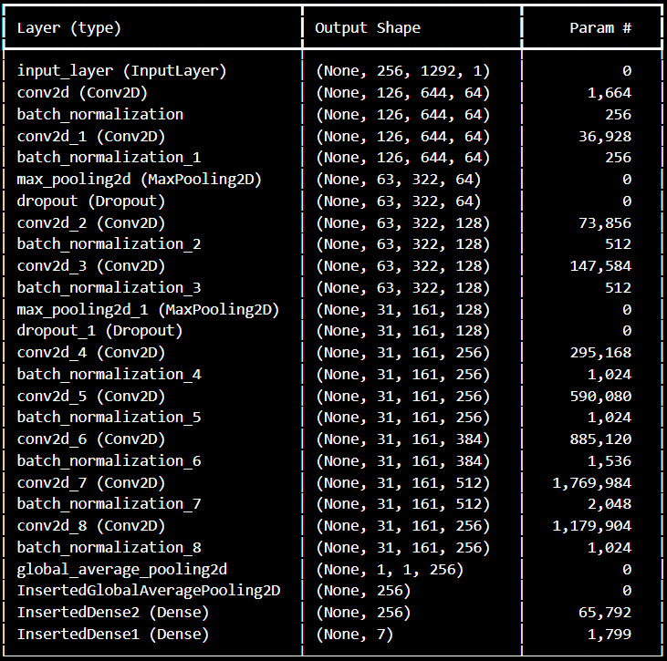

# 🎧 **Mid-Level Perceptual Features Multi-Label Classification Model**

This multi-label classification model was developed to annotate the existing Emotify dataset, with the goal of identifying the relationship or correlation between emotional annotations and mid-level perceptual music features.

Version 2 of the re-annotated and multi-label classification model was deemed ineffective and therefore not used. Only Version 1 of the model was utilized. All layers of the model were frozen to preserve the learned weights. A linear probe was then added to identify the relationship between emotional annotations and mid-level perceptual music features, helping to remove the "black box" nature of the model.

These two datasets and their annotations will be used in my future personal research, aiming to produce high-quality therapeutic music.

---

## 📊 **Model Version 1 Performance Overview**
Feeding Emotify Dataset
- **Training Accuracy**: `0.7171`  
- **Training Loss**: `0.0575`  
- **Validation Accuracy**: `0.7124`  
- **Validation Loss**: `0.0551`
---

## 📈 **Threshold-Based Evaluation (Macro Averaged Metrics)**

To evaluate the model's performance at different thresholds, the following metrics were calculated:

### **Threshold: 0.3**
- **Precision**: 0.9132  
- **Recall**: 1.0000  
- **F1 Score**: 0.9538  
- **Accuracy**: 0.9100  

### **Threshold: 0.4**
- **Precision**: 1.0000  
- **Recall**: 1.0000  
- **F1 Score**: 1.0000  
- **Accuracy**: 1.0000  

### **Threshold: 0.5**
- **Precision**: 1.0000  
- **Recall**: 0.8992  
- **F1 Score**: 0.9461  
- **Accuracy**: 0.8850  

### **Threshold: 0.6**
- **Precision**: 1.0000  
- **Recall**: 0.8477  
- **F1 Score**: 0.9159  
- **Accuracy**: 0.8175  
### VGG-style Network for Predicting Mid-Level Features from Audio

- **Based on the model by [Chowdhury et al.](https://arxiv.org/abs/1907.03572)**

| Layer (type) | Output Shape | Param # |
|--------------|--------------|---------|
| input_layer (InputLayer) | (None, 256, 1292, 1) | 0 |
| conv2d (Conv2D) | (None, 126, 644, 64) | 1,664 |
| batch_normalization (BatchNormalization) | (None, 126, 644, 64) | 256 |
| conv2d_1 (Conv2D) | (None, 126, 644, 64) | 36,928 |
| batch_normalization_1 (BatchNormalization) | (None, 126, 644, 64) | 256 |
| max_pooling2d (MaxPooling2D) | (None, 63, 322, 64) | 0 |
| dropout (Dropout) | (None, 63, 322, 64) | 0 |
| conv2d_2 (Conv2D) | (None, 63, 322, 128) | 73,856 |
| batch_normalization_2 (BatchNormalization) | (None, 63, 322, 128) | 512 |
| conv2d_3 (Conv2D) | (None, 63, 322, 128) | 147,584 |
| batch_normalization_3 (BatchNormalization) | (None, 63, 322, 128) | 512 |
| max_pooling2d_1 (MaxPooling2D) | (None, 31, 161, 128) | 0 |
| dropout_1 (Dropout) | (None, 31, 161, 128) | 0 |
| conv2d_4 (Conv2D) | (None, 31, 161, 256) | 295,168 |
| batch_normalization_4 (BatchNormalization) | (None, 31, 161, 256) | 1,024 |
| conv2d_5 (Conv2D) | (None, 31, 161, 256) | 590,080 |
| batch_normalization_5 (BatchNormalization) | (None, 31, 161, 256) | 1,024 |
| conv2d_6 (Conv2D) | (None, 31, 161, 384) | 885,120 |
| batch_normalization_6 (BatchNormalization) | (None, 31, 161, 384) | 1,536 |
| conv2d_7 (Conv2D) | (None, 31, 161, 512) | 1,769,984 |
| batch_normalization_7 (BatchNormalization) | (None, 31, 161, 512) | 2,048 |
| conv2d_8 (Conv2D) | (None, 31, 161, 256) | 1,179,904 |
| batch_normalization_8 (BatchNormalization) | (None, 31, 161, 256) | 1,024 |
| cast_2 (Cast) | (None, 31, 161, 256) | 0 |
| global_average_pooling2d_1 (GlobalAveragePooling2D) | (None, 256) | 0 |
| Dense1 (Dense) | (None, 256) | 65,792 |
| dropout_2 (Dropout) | (None, 256) | 0 |
| dense (Dense) | (None, 7) | 1,799 |

> 🛠️ **Note:**  
The last few layers can be fine-tuned to adjust the model for different output dimensions or to improve performance on specific downstream tasks.

### Model Weights Mapping Mid-Level Audio Features to GEMS Emotion Dimensions
