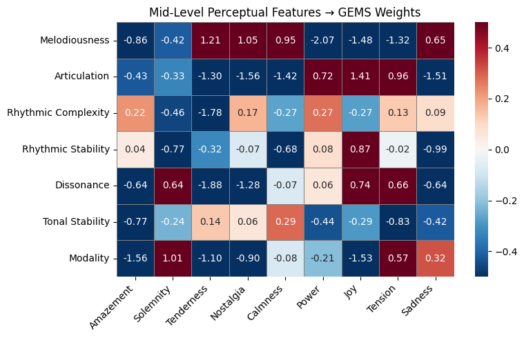

# 🎧 **Mid-Level Perceptual Features Multi-Label Classification Model**

This multi-label classification model will be used to annotate the existing **Emotify dataset** with the goal of identifying the relationship or correlation between **emotional annotations** and **mid-level perceptual music features**.

---

## 📊 **Model Performance Overview**

- **Training Accuracy**: `0.7782`  
- **Training Loss**: `0.0018`  
- **Validation Accuracy**: `0.7840`  
- **Validation Loss**: `0.0016`  

---

## 📈 **Threshold-Based Evaluation (Macro Averaged Metrics)**

To evaluate the model's performance at different thresholds, the following metrics were calculated:

### **Threshold: 0.3**
- **Precision**: 0.9991  
- **Recall**: 0.9996  
- **F1 Score**: 0.9993  
- **Accuracy**: 0.9980  

### **Threshold: 0.4**
- **Precision**: 0.9992  
- **Recall**: 0.9996  
- **F1 Score**: 0.9994  
- **Accuracy**: 0.9984  

### **Threshold: 0.5**
- **Precision**: 0.9992  
- **Recall**: 0.9983  
- **F1 Score**: 0.9988  
- **Accuracy**: 0.9976  

### **Threshold: 0.6**
- **Precision**: 0.9992  
- **Recall**: 0.9983  
- **F1 Score**: 0.9988  
- **Accuracy**: 0.9976  
### VGG-style Network for Predicting Mid-Level Features from Audio

- **Based on the model by [Chowdhury et al.](https://arxiv.org/abs/1907.03572)**

> 🛠️ **Note:**  
The final two Dense layers can be fine-tuned to adjust the model for different output dimensions or to improve performance on specific downstream tasks.
